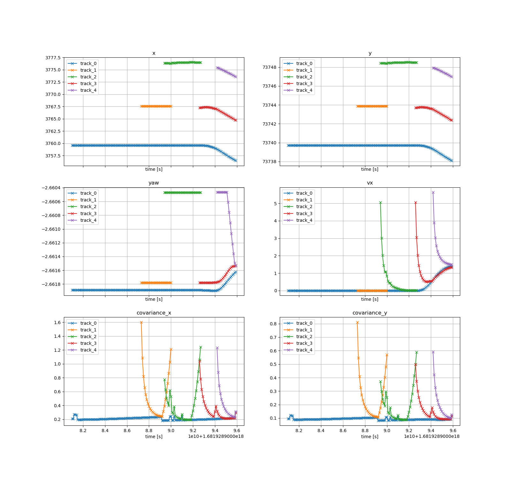

# Tracking Validation Tools for Autoware

This repository provides the tools for tracking validation.


## Installation

[TBD]


# Tools


## rosbag tracking visualization

- Try to plot tracking result from rosbag file.
- parse rosbag2 into dict and then plot with matplotlib.


```bash
python plot_tracking_result.py --bag_file <path_to_rosbag_file>
```

Default figure is shown like this:


